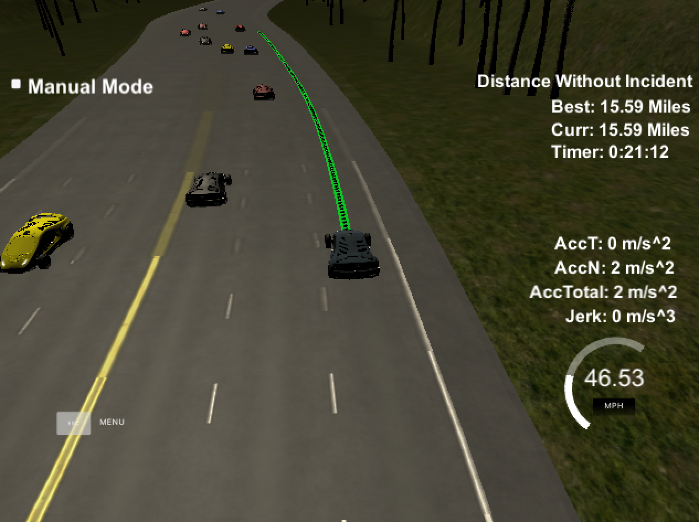

Path Planning
==========

[Click Image to view Video](https://vimeo.com/268902454)

Model Documentation
-------------

For most of the time spent on the project, I focused on a Finite State Machine (FSM) based model, but had a lot of challenges getting it to work as expected, probably related to the fact that I was switching in and out of Frenet Coordinates from XY cartesian coordinates and the errors built up. Recently however, I switched to a simpler Jerk Minimization Trajectory (JMT) method as described in the [BMW paper](http://video.udacity-data.com.s3.amazonaws.com/topher/2017/July/595fd482_werling-optimal-trajectory-generation-for-dynamic-street-scenarios-in-a-frenet-frame/werling-optimal-trajectory-generation-for-dynamic-street-scenarios-in-a-frenet-frame.pdf), where everything is done in Frenet coordinates before transitioning back to XY.

First, we either generate the car's current state from a full stop, or reuse the previous trajectory to get values for position, velocity, and acceleration. This helped avoid the noise where the simulator didn't provide reliable values for s, d, and v. It also adds a more reliable acceleration. Then we get all of the vehicles that are close to us and feed them, the s and d states, a time_horizon (how far into the future we want to generate a trajectory for), and the car's controller class that keeps track of useful information like the speed_limit all into `planner.generate_trajectories()`.

In generate_trajectories(), we separately generate a set of s and d trajectories using slightly different tactics. For s trajectories, we generate 30 different trajectories. 5 different final_time values and 6 different speeds each evenly split. For d trajectories, we generate 18 different trajectories. One for each of the 3 lanes and 6 different final times. Quntic Polynomials are used to calculate the JMT for a given start and goal state for each s and d trajectory. Finally, we combine each s trajectory with every d trajectory while filtering out any trajectories that would violate the dynamics of our vehicle or would lead to a collision (or at least be closer than our tolerences). While doing that we also use our cost function to calculate how much cost each 2D Trajectory incurs.

With a set of valid 2D Frenet trajectories, we select the one with the lowest cost and convert it into x/y coordinates at the interval of 0.02 seconds and return that to the simulator.
